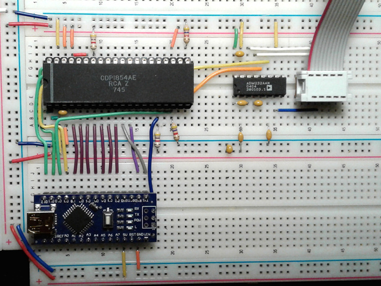
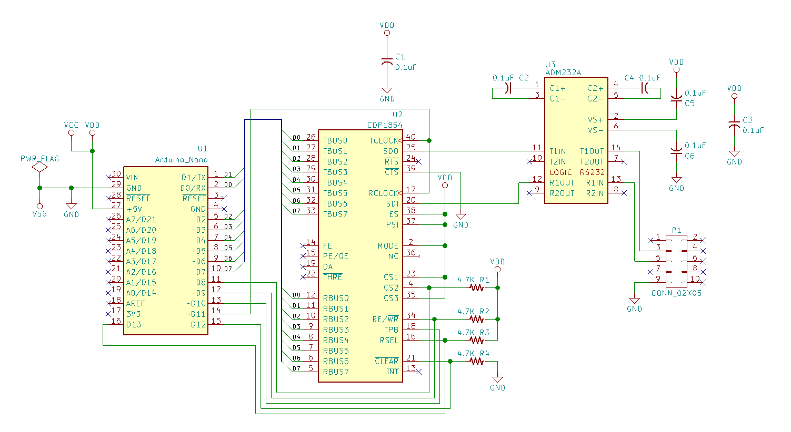

# Arduino based 1854 UART tester

This is a quick and dirty test jig for a CDP1854 UART. It uses an
Arduino Nano to set up and control the UART. A MAX232 style chip is
used to provide a RS232 level signals for a serial connection.

The Nano configures the UART for 9600 baud, 8 data bits, 1 stop bit and
no parity. On reset, it sends out an introductory blurb to let you know
that at least the transmit portion of the UART is working. You can then
type characters on the terminal/computer you've got hooked up to the
serial connection to see that the receive portion of the UART is also
working.

On an ANSI type terminal, pressing the Insert key will produce a canned
blurb.

It's nothing fancy, but if you've got some CDP1854s sitting around and
a burning desire to see if they work, this program and schematic will
get you started.

